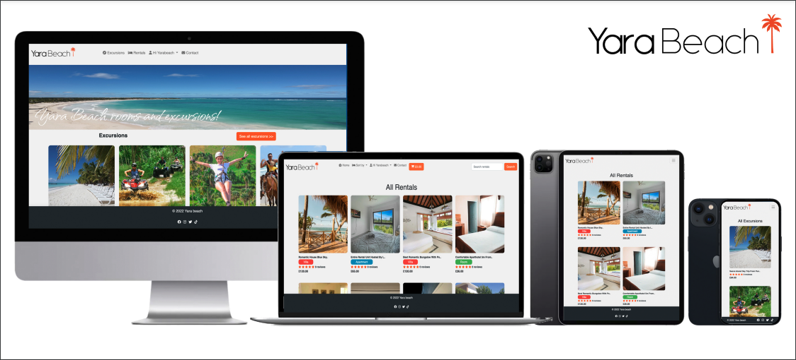

<h1 align="center">Yara Beach Excursions and Rentals </h1>

<h2 align="center">Code Institute - Milestone Project 4</h2>


<sub>_Created using_ [Adobe Photoshop](https://www.adobe.com/uk/products/photoshop/landpa.html?gclid=CjwKCAjwwL6aBhBlEiwADycBIKPGhQtahSxttLjZVTUJ7djn4sFEDI1p6gUoIk5PJzHRyigcU7Rm-BoCQtcQAvD_BwE&mv=search&mv=search&sdid=GVTYXZY8&ef_id=CjwKCAjwwL6aBhBlEiwADycBIKPGhQtahSxttLjZVTUJ7djn4sFEDI1p6gUoIk5PJzHRyigcU7Rm-BoCQtcQAvD_BwE:G:s&s_kwcid=AL!3085!3!594259336243!e!!g!!adobe%20photoshop!17011954559!138864791987/)</sub>
<br>

Yara Beach is an e-commerce website. Yara is the actual name of the owner, who is my friend from the beautiful island of the Dominican Republic. During the process of building my portfolios through the Code Institute, I decided that my last project or portfolio would be a real-use website. So I contacted my friend Yara, who has a business called Yara Beach. I told her I'd create a website for her to attract more customers and increase sales. She was so happy to hear that and agreed, so I asked her what it was that she needed the website to have based on her customers' needs. She sells excursions and rentals through Airbnb and Booking.com. She needed a combined website for excursions and rentals, and waala, here we have the Yara Beach website, where she will be able to keep track of her customers when they register and see all the oncoming bookings, e.g., today's bookings, future bookings, and previous bookings for excursions and rentals. Customers will be able to view all their current bookings, previous bookings, and future bookings for both excursions and rentals as well. Customers will be able to leave review ratings and view beautiful product details with many images showcasing the products. The owner will be able to add products, delete products, edit products, and put products on active or inactive status.

This project was mainly created to satisfy the final Milestone Project requirements of the Full
Stack Web Development Program at the [Code Institute](https://codeinstitute.net/).
This full-stack website, with its fully-implemented authentication mechanism and
payment system and control of a centrally-owned dataset, was constructed using
[HTML5](http://en.wikipedia.org/wiki/HTML5), [CSS3](http://en.wikipedia.org/wiki/CSS),
[JavaScript](https://en.wikipedia.org/wiki/JavaScript), the JavaScript library
[jQuery](https://jquery.com/) , [Python](<https://en.wikipedia.org/wiki/Python_(programming_language)>),
[Django](https://www.djangoproject.com/), [Heroku Postgres](https://www.heroku.com/postgres) database
and the [Stripe](https://stripe.com/) payment platform.

[Click here to visit the site.](https://yara-beach.herokuapp.com/)

To test the site's checkout process please use the test credit card number provided in
the [Stripe Documentation](https://stripe.com/docs/testing):

- Card Number: 4242 4242 4242 4242
- Expiration Date: Any date (e.g. 02/04)
- CVC: Any three digits

<br>

## **Table of Contents**

1. [**User Experience (UX)**](#ux)
   - [Project Goals](#project-goals)
   - [User Stories](#user-stories)
     - [Prospective User](#prospective-user)
     - [Existing User](#existing-user)
     - [Site Owner](#site-owner)
2. [**User Centered Design**](#user-centered-design)
   - [1) The Strategy Plane](#1-strategy-plane)
   - [2) The Scope Plane](#2-scope-plane)
   - [3) The Structure Plane](#3-structure-plane)
     - [Planning](#planning)
     - [Existing Features](#existing-features)
       - [Favicon](#favicon)
       - [Title](#title)
       - [Navbar](#navbar)
       - [Toast Messages](#toast-messages)
       - [Breadcrumbs Navigational Links](#breadcrumbs-navigational-links)
       - [Pagination Links](#pagination-links)
       - [Product and BlogPost Cards](#product-and-blogpost-cards)
       - [Free Delivery Banner](#free-delivery-banner)
       - [Newsletter Subscription Form](#newsletter-subscription-form)
       - [Footer](#footer)
       - [Home Page Features](#home-page-features)
       - [Our Story Page Features](#our-story-page-features)
       - [Contact Us Page Features](#contact-us-page-features)
       - [Products Page Features](#products-page-features)
       - [Product Detail Page Features](#product-detail-page-features)
       - [Add Product Page Features](#add-product-page-features)
       - [Edit Product Page Features](#edit-product-page-features)
       - [Add Product Review Page Features](#add-product-review-page-features)
       - [Edit Product Review Page Features](#edit-product-review-page-features)
       - [Cart Page Features](#cart-page-features)
       - [Checkout Page Features](#checkout-page-features)
       - [Checkout Success Page Features](#checkout-success-page-features)
       - [My Account Page Features](#my-account-page-features)
       - [Blog Page Features](#blog-page-features)
       - [BlogPost Page Features](#blogpost-page-features)
       - [Add BlogPost Page Features](#add-blogpost-page-features)
       - [Edit BlogPost Page Features](#edit-blogpost-page-features)
       - [Add BlogComment Page Features](#add-blogpost-comment-page-features)
       - [Edit BlogComment Page Features](#edit-blogpost-comment-page-features)
       - [Custom 404 and 500 Page Features](#custom-404-and-500-page-features)
       - [Authorisation Pages Features](#authorisation-pages-features)
     - [Features Left to Implement](#features-left-to-implement)
   - [4) The Skeleton Plane](#4-skeleton-plane)
     - [Wireframes](#wireframes)
   - [5) The Surface Plane](#5-surface-plane)
     - [Design](#design)
     - [Colour Scheme](#colour-scheme)
     - [Icons](#icons)
     - [Typography](#typography)
3. [**Development**](#development)
   - [Information Architecture](#information-architecture)
     - [Data Schema](#data-schema)
     - [Data Models](#data-models)
4. [**Technologies Used**](#technologies-used)
5. [**Testing**](#testing)
6. [**Deployment**](#deployment)
   - [Local Deployment](#local-deployment)
   - [Heroku Deployment](#heroku-deployment)
     - [AWS](#set-up-an-amazon-web-services-account)
     - [S3](#set-up-the-simple-storage-service-bucket)
     - [Stripe](#link-stripe-to-heroku)
     - [Gmail](#set-up-django-emails-using-gmail)
7. [**Credits**](#credits)
   - [Content](#content)
   - [Media](#media)
   - [Acknowledgements](#acknowledgements)

<br>

---

## UX

Yara Beach sees the need to provide the user with a website where they can find all their needs in one place, e.g., excursions and rentals. On Yara Beach, users are able to book a place to stay in the Dominican Republic as well as excursions before or during their holidays, all on the same platform.
<br>

### Project Goals
The goals of this project are to
- Make Yarabeach a global outreach.
- ability to optimise (time, expenses , human labour, infrastructure, and more) for Yarabeach.
- We get a higher margin because it is our own platform and we do not have to pay for a percentage, e.g., at Arbnb or Booking.com.
- ability to catch a customer in its natural habitat and communicate with the customer directly without restriction.
- Getting international customers
- personalization of the buying experience,
- A catalogue of rentals and excursions
- reviews and ratings for rentals and excursions, which determine what the customer likes and dislikes.
- Make Yarabeach brand recognition international.
- Have the visitors contact us for any queries.

<br>

##### back to [top](#table-of-contents)

---

### User Stories

#### Prospective User

I am a future Yarabeach site member  I want to be able to:

- Immediately comprehend the purpose behind the Yarabeach site.
- Easily see what products are available.
- Search for specific excursions and rentals filtered by newest, oldest, price range from low to high, and high to low,
- Easily filter in rental app by rental type: Room, House and villa.
- Have a navigation bar where I can directly type in the product I'm looking for and it will immediately appear.
- I should be able to navigate to different apps easily.
- If I am in a certain app, I should be able to see the title of the app so I can see where I am.
- See all related images of excursions or rentals related to the app.
- See more details once I click on the rentals or excursions.
- Be able to read a well-documented description of each product.
- Read excursion or rental reviews.
- Add products to my shopping cart with ease.
- Be presented with a constant visual reminder of my shopping cart total and the number of items already added.
- Be able to edit my shopping cart, increasing or decreasing the number of children and adults going on an excursion or rental, updating the date that has been selected or deleting it altogether, at will.
- Pay for my items using a secure credit card payment system.
- I immediately receive visual feedback when my payment has been accepted.
- Receive a detailed email confirming my purchase and order number so I can easily print it and show it on arrival.
- Easily locate any social media accounts connected to the site.
- Navigate through the site with ease.
- Easily register to become a site member.
- Easily get in contact with Yarabeach if I have any questions.


#### Existing User

I am an existing Yarabeach site member. I want to be able to:
- Log in to the site.
- Navigate through the site with ease.
- Log out of the site.
- Reset my password securely.
- Add items to my shopping cart with ease.
- Be able to edit my shopping cart, increasing or decreasing the number of children and adults going on an excursion or rental, updating the date that has been selected or deleting it altogether, at will.
- Purchase my desired products using a secure online payment system.
- Be presented with a constant visual reminder of my shopping cart total and the number of items already added.
- Receive a detailed email confirming my purchase and order number so I can easily print it and show it on arrival.
- View my order history.
- View my future orders
- View my order with today's date.
- Search for specific excursions and rentals filtered by newest, oldest, price range from low to high, and high to low,
- In the rental app, be able to easily filter by rental type: Room, House, or Villa.
- Review and rate an excursion or rental previously booked.
- Navigate with ease through the site.
- Contact the Yarabeach owner.
- Read detailed descriptions of excursions and rentals.
- Have a navigation bar where I can directly type in the product I'm looking for and it will immediately appear.

#### Site Owner

As the owner of the Yarabeach website, I would like to:
- Provide users with an effective and user-friendly platform where they can see what products Yara Beach has to offer.
- Provide visitors with visually appealing images of the products on offer.
- Provide visitors with information about the excursions or rentals, such as title, description, price, and a nice form to add to the cart.
- Provide visitors with excursions or rental images , not just one standard image, and the ability to click and navigate through them.
- Provide site users with an easy way to add their desired product to their cart.
- Provide users with a visual representation of their cart total and the number of products already added, visible on all screens in the app.
- Provide users with an updated total when they add or remove products from their cart.
- Provide users with an easy-to-use and secure online payment process.
- Present the reviews and ratings in a visually appealing format.
- Present how many reviews an item has.
- Provide the user with the ability to search for specific excursions and rentals filtered by newest, oldest, price range from low to high, and high to low.
- In the rental app, provide a way to easily filter by rental type: room, house, or villa.
- Provide prospective members with the ability to sign-up easily.
- Provide visible contact details so that all site visitors can contact the Yarabeach with ease.
- Be able to add new excursions or rentals to the website with ease.
- Be able to edit existing excursions or rentals with ease.
- Delete or discontinue excursions or rentals that are no longer available, removing their images and information from the website.
- Be able to activate a product if I want to see it live, or inactive a product for any reason without deleting it.
- Provide site visitors with the ability to edit the shopping cart, increasing or decreasing the number of children and adults going on an excursion or rental, updating the date that has been selected or deleting it altogether, at will.
- Be a ble to have an administrator page where I can add excursions or rentals.
- Be a ble to have an administrator page where I can edit excursions or rentals.
- Be a ble to have an administrator page where I can delete excursions or rentals.
- Be able to have an admin dashboard where we can see the total number of users we have
- Be able to have an admin dashboard where we can see the total number of rental bookings for the day.
- Be able to have an admin dashboard where we can see the total number of excursion bookings for the day.
- In the dashboard, be able to have a description of the excursions bookings of the day. so we can prepare for their arrival.
- In the dashboard, be able to see a description of the rental bookings for the day. so we can prepare for their arrival.
- In the dashboard,  be able to see the future excursion bookings.
- In the dashboard,  be able to see the previous excursion bookings.
- In the dashboard,  be able to see the future rental bookings.
- In the dashboard,  be able to see the previous rental bookings.
- In the excursions and rentals admin list, they show a link where we can go directly and see the product.
- Have a beautiful CKeditor that we can easily add a description of the product to in admin.
- Have the ability to add and see more images on edit admin.
- Have the ability to see the status of the product on the excursion and rental list.
- Have the ability to see the user's contact info like email, full name, phone number, and booking number.
- Have easy access to the home customer page and the admin page and vice versa.
- Provide a detailed email confirming the customer's purchase and order number so they can easily print it and show it on arrival.
- Provide the user with the search bar where they can type in any product they wish to see.
- Provide a user with a pagination so that they know where they are and if there are more products.

<br>

##### back to [top](#table-of-contents)

---
## User Centered Design

### 1 Strategy Plane


The User Stories that we just wrote above were used to maintain a focus on user needs and business goals during the design process.


The Yara Beach website is a Business-To-Consumer (B2C) model aiming to provide a beautiful holiday experience, including stays and excursions.


Yara Beach is not exactly a holiday package because you can not buy rentals and excursions under just one price. In the meantime, this sounds beautiful and we will use it in the future. I spoke to Yara, the future owner of this website, and this is what she had to say: "Our aim was never to sell excursions at the same time as rentals. We use booking.com and Airbnb to show our catalogue of rentals, but when customers contact us, they always have queries about excursions. They often ask if we sell any excursions like boogies, the famous Sahona island, etc., so we end up contacting a real excursion company and making very good deals with them for our customers, so they can have all the packages we offer. It is important to say that our own customers have been deceived on the beach by people who were selling them fake excursions. They have informed us about this problem, and this is how we came to the conclusion of offering our customers excursions as well before they arrive. so they will not be deceived anymore."

<br>

##### back to [top](#table-of-contents)

---

### 2 Scope Plane

The key features of the website were developed based on user needs.

Users should be able to do the following on the website:

- Navigate and interact with the site with ease.
- Ensure the interactivity is intuitive.
- Ensure the layout and design are responsive to all media sizes.
- Allow users to create an account, confirm their email address, change their password, -  log in, and log out.
- Contact the store with any queries.
- Easily access the site’s social media channels.
- Be able to type in  search bar any product they wish to see, according to the app.
- In rentals, users should be able to sort by newest, oldest, price low to high, price high to low, all rooms, all apartments, all villas.
- In Excursions, users should be able to sort by newest, oldest,price low to high,price high to low, all rooms, all apartments, all villas.
- The admin user should be able to go from customer page to admin and admin to customer page. 
- A super user should be allowed to see the admin panel.
- An authenticated user or an anonymous user should not be allowed to edit, delete, add products, or even go to admin pages.
- Read a description of the product.
- - See the reviews and rate the product.
- Upload a rental review for a rental they themselves purchased through the site.
- Upload an excursion review for an excursion they themselves purchased through the site.
- Add an excursion to their cart.
- Add a rental to their cart.
- Excursions should be removed from their carts.
- Take the rentals out of their carts.
- Update the excursion cart, e.g., excursion date, adult quantity, child quantity, and automatically update the subtotal price and the total.
- Update the rental cart, e.g., echeck-in,checkout, adult quantity, child quantity, and automatically update the subtotal price and the total.
- Have the link handy if you want to keep shopping. and a link that sends them to checkout if there are items in the cart.
- In rental checkout, users should be able to see a detailed view of the item they are about to be charged for. It should contain the following: the title, subtotal, image of the product, check-in, checkout, how many adults and children, rental type, and the total price.
- In excursion checkout, users should be able to see a detailed view of the item they are about to be charged for. It should contain the following: the title, subtotal, image of the product, excursion date, how many adults and children, rental type, and the total price.
- Next to the product view details of items, there should be a field to enter the user's contact information and a field for payment. There is also a button with the total to pay and process the payment.
- Receive immediate visual feedback that their payment has been processed and their order confirmed, containing the order numbers for every item and the amount paid. We also informed them that we had sent an email with all the booking information and a link to go home.
- Receive an email confirming their order with all the details.
- In the user's profile, they should then be able to go to excursions bookings or rentals bookings to see their order history.
- In order's histoy, they should be able to see today's bookings, future bookings, and previous bookings.

<br>

##### back to [top](#table-of-contents)

---

### 3 Structure Plane

#### Planning
Competitive Yara Beach website research includes
[Airbnb](https://www.airbnb.co.uk/),
[Booking.com](https://www.booking.com/),
[Biator](https://www.viator.com//),
[Everythingpuntacana](https://everythingpuntacana.com/),
[Jackana](https://jackcana.tours/),
revealed structural commonalities that Yarabeach  would be expected to follow in order to create an intuitive shopping experience  for the holiday makers


The most prominent navigation buttons on the mobile navbar on these sites, visible at all times, were the following:
- **site logo**, which operates as a **Home Button**,
- the **dropdown menu toggle**, which reveals and hides the other menu items on mobile.
- the **User Profile icon**, allowing users to **login**/**logout** or **access their account**. View all bookings
- the **Search bar** 
- the **Sort by button**, which does all the filters.
- the **Shopping Cart**. 
- the **Contact**, which contacts the store with any queries.

<br>

##### back to [top](#table-of-contents)

---

#### Existing Features

After identifying the needs of the site's users and after visiting other similar sites, the following website design and features were chosen:

##### Favicon

A **website logo as favicon**, displayed on the web browser's tab,
allows the desktop user to identify the website by sight.

##### back to [top](#table-of-contents)
---

##### Title

The **Title**, displayed on the web browser's tab at all times,
contains the business's title.

--- 

##### Navbar
The navbar contains all the links to navigate through the pages.
The **home page** navbar contains the **excursions** app link, the **rental** app link, a user dropdown button, and a contact link.
The **rental** page navbar contains the links back to the **home page**, sort by **dropdown for rentals**, a user dropdown button, contact link, and a search bar with a button to the right.
The **excursion** page navbar contains the link back to the home app, sort by **dropdown for excursions**, a user dropdown button, a contact link, and a search bar with a button to the right.


- The **Account user icon with the user name** opens a dropdown menu with links related to what the user's status is. For instance, anonymous user, authenticated user, and superuser.

<br>

| Logged-Out User | Logged-In User     | Superuser       |
| :-------------- | :-------------     | :-----------    |
| Sign in         |    Logout          | Logout          |
| Register        | change Password    | change Password |
|                 | Excursions Bookings| Admin Board     |
|                 | Rentals Bookings   |                 |


##### back to [top](#table-of-contents)

---

##### Django Messages

**Dajngo message** have been used throughout the site to display
alert messages to the user, to provide feedback and to assist them in
achieving their aims. These messages are color-coded using bootstrap alert classes for ease of understanding, in red for error messages, and green for success messages. 

##### Home 
The Home page display all non-private recipes of the site and it is very responsive when it comes to a different device, it is composed of 5 cards if its a large device like a monitor or computer, and if it is a tablet device it has 3 cards, mini table with 2 cards, mobile of 750px down the home page just display 1 card. each card contains. an image, title, recipe owner name, and a comment sign along with the number of comments that recipe has.

##### Contact page 
The contact page contains a header title, a sentence encouraging the user to email the administrator, 3 texts input and a big texterea. also in the right corner, the is a button with the value of submit.

##### My Recipes page 
The My Recipes page which is only available for registered users, contains almost the same layout as the home page, except that on every card there are two buttons one for edit and another one for delete. at top of the page below, the header title,  there is a button with a plus sign where the user can click and add their recipes.

##### Login page 
The Loging page contains a card with a header title, two fields: one for the password and another one for the username, and a button below with a login text, below the button there is a sentence with the link of sign up and another one with the link to reset the password in case they have forgotten. each input field has a beautiful icon: one is a user icon and the other one is a key icon.

##### Sign up page 
The signup page contains the same as the login page exept that it contains 2 more input fields, which are the email and the comfirmation of the second password, also it has a sentence with a login link,  in case the user already has the credentioal to login. 

##### 404 page
Once the user navigates to a wrong path inside myonlinerecipes site, it will be redirected to a beautiful image which contains a button to return home, the header of the image saying 404 and a sentence letting the user know that he went to a run URL.

##### footer
The footer is statically positioned at the bottom of the page. Similar to the header, contrary to the header the footer's content stay in line when the content exceeds the viewport of the device. The footer contains a link to the project’s GitHub repository, the facebook  link of the site as well as the instagram link, and  also a link to my personal linkedIn profile.

### Skeleton

The UI wireframing tool, [Balsamiq](https://balsamiq.com/), was used to create wireframes for each page of the game as it would appear on desktop, tablet, and mobile devices.

The main content areas were expressed in similar ways to create consistency across the site. A home page featuring the name of the game and a start bottom, a main screen with all cards identical. Top left-hand corner features a flag poll that counts down, top right of the screen shows the game points, a contact page, and a footer, which contains very important information: copy right, LinkedIn link, GitHub link, all of these were included at the bottom of every page to help users navigate through the game efficiently.

<br>

#### Wireframes

##### Desktop

- [Home Page wireframe: ](./myonlinerecipes/static/documentation/wireframes/Home-desktop.png)

- [Contact Page wireframe: ](./myonlinerecipes/static/documentation/wireframes/contactpage-desktop.png)

- [Login page wireframe: ](./myonlinerecipes/static/documentation/wireframes/loginpage-destop.png)

- [Add Recipes form wireframe: ](./myonlinerecipes/static/documentation/wireframes/Addrecipeform-desktop.png)

- [My Recipes page wireframe: ](./myonlinerecipes/static/documentation/wireframes/myrecipespage-desktop.png)

- [Register account page wireframe: ](./myonlinerecipes/static/documentation/wireframes/Registeraccountpage-desktop.png)


##### Tablet
- [Home Page wireframe: ](./myonlinerecipes/static/documentation/wireframes/Home-tablet.png)
- [Contact Page wireframe: ](./myonlinerecipes/static/documentation/wireframes/contactpage-tablet.png)
- [Login page wireframe: ](./myonlinerecipes/static/documentation/wireframes/loginpage-tablet.png)
- [Add Recipes form wireframe: ](./myonlinerecipes/static/documentation/wireframes/Addrecipeform-tablet.png)
- [My Recipes page wireframe: ](./myonlinerecipes/static/documentation/wireframes/myrecipespage-tablet.png)
- [Register account page wireframe: ](./myonlinerecipes/static/documentation/wireframes/Registeraccountpage-tablet.png)


##### Mobile
- [Home Page wireframe: ](./myonlinerecipes/static/documentation/wireframes/Home-mobile.png)
- [Contact Page wireframe: ](./myonlinerecipes/static/documentation/wireframes/contactpage-mobile.png)
- [Login page wireframe: ](./myonlinerecipes/static/documentation/wireframes/loginpage-mobile.png)
- [Add Recipes form wireframe: ](./myonlinerecipes/static/documentation/wireframes/Addrecipeform-mobile.png)
- [My Recipes page wireframe: ](./myonlinerecipes/static/documentation/wireframes/myrecipespage-mobile.png)
- [Register account page wireframe: ](./myonlinerecipes/static/documentation/wireframes/Registeraccountpage-mobile.png)

<br>

### Database

**MyOnlineRecipes** utilises a relational Database via PostgreSQL for storing **User**, **Recipes** and **Comments** data.

- The **User** model is composed of 7 columns: username, email, password, date created, the last login of the user and an image of the user. The only field that are quired are title, Ingridients and method and they all have a * at the top. The User model has one to many relationships with the **Recipes** model and **Comments** model which help to access that data and filter it by the user id. by setting one to many relationships we were able to have multiple recipes and comments that belong to just one user.

- The **Recipes** model is composed of 15 columns, the main id which is set to Primary Key. Furthermore is connected by its id to the **Comments** model. The **Recipes** model has a one to many relationships with the **Comments** which means that a recipe can have many comments.

- The **Comments** model is composed of 7 columns including the id as well. this model does not have one to many relationships with other models but it can easily access to the **User** and **Recipes** model because of its **backref relationship** that points from **User** and **Recipes** to **Comments**

- Database schema design was created using [DrawSql](https://drawsql.app/), see below.


### Surface

##### Design
The Project Design is a combination of my own design implemented with the bootstrap framework. The colour helps the website to stand out and give a clear meaning of what the website is about as the colour is usually found in food and nature. Its aim is to be engaging, alluring, and cohesive.

##### Logo design 
The logo of the site is located on the left side of the navbar as the bootstrap standard logo, and it is bigger than the others links in order to stand out. and make it recognised by the users.

##### Colour Scheme
The colour scheme for the game was chosen in order to convey excitement, clean and visually appealing site.


<br>

<sub>*Colour palette created at* [coolors.co](https://coolors.co/ffbe0b-fb5607-ff006e-8338ec-3a86ff).</sub>

- #004b49, Deep jungle green,Psychologically, when humans think of this color, Deep jungle green, they might associate it with being clean, glamorous, elegant, the home, and accessibility.
     - Used in the navbar and in the footer as it makes a beautiful combination.

- #f2f2f2, Culture color, which is a light grey represent neutrality and balance. 
   - Used in the background of the website in order to the main content stand out.

- #ffffff, White represents purity or innocence and stands for everything good and right.
- Use in all the links of the text
- Used in the Card
- As main color text

- #626567, Granite Grey, used in the card for the text as it is darker than the Culture colour and makes the text to be more visible.

- #000000, Black color represents evil, darkness, night, and despair. It’s the color used to convey certainty and authority.
- Used in all header title so the users knows at glance where they are located


#### Icons
Icons were used within the site in order to help the user to understand the content easier. 
They were taken from [Font Awesome](https://fontawesome.com/) and chosen to be self explanatory.

#### Typography
After an intensive search for the right font, I encountered Montserrat, the most used font for recipes websites, this font I have used to be a company with Georgia and serif in case Montserrat does not load. I have used this font for the body of the website.

## Existing Features

The project consists of three main pages, and has a 404.html and 500.html error page, login and logout functionality, a response page page for for the contact, myrecipes that is where all the recipes for the user is stored, and the home page. The main pages can be accessed through the navbar.

**Fabicon**

Myonlinerecipes favicon, displayed on the web Brower’s tab, allows the user to identify the website by sight.
 
**More Features**

- **myonlinerecipe Logo**: It is the default logo style for boostrap but recognizable across all website.

- **The recipe form Page** and **The edif form Page**: allow the user to craete beatiful recipes, I added a rich ckeditor which help to tape the ingridients and method easier and more beatiful.

- **The Search functionality**: allow the user to search for any recipe in the database except for the recipe that are privat. they are allow to search by method, title and ingridients.

- **Commet section**: allow the user comment on any recipe and even ask questions about the recipe. All users can interact with each other this way and share their experiend with the recipe.


**Footer**
Each page has a fixed footer at the bottom. This provides Facebook, Instagram, Twitter and Tik Tok links as well as a copyright with my name on it.

#### (home) features
  - In home we can see the all the beatiful recipes, a big heading title so the user understand where it is located and a navbar and footer.
  - in Navbar we can vizualize the all links in color white and background green. all links contains icons to make the user understand at glance.
  - Footer contains copyright and links with the same color schema of the navbar.

#### Myrecipe page feature
  - The same as the home page except that it has:
  - A edit button, 
  - Delete button,
  - Add recipe button bellow the heading title

#### contact.html features
  - Title encoraging user to send a mesage.
  - A well structured contact form with 5 fields: name, subject, email, and message with a submit btn at the end.

#### contact-response.html features
  - Has a positive message comfirming to the user that their message has been sent.
  - A botton that redirect the user back home if desired.


  #### 404.html features
  - Has a message informing the user that the page they are loking for does not exist.
  - A botton that redirect the user back home if desired.
  - A footer with icons and links and navbar


  #### 500.html features
  - Has a message informing the user that something went wrong.
  - A botton that redirect the user back home if desired.
  - A footer with icons and links and navbar


### Future Feature Considerations
  - For adding future features I would like to add pagination and a password reset function that send an email to the user and logged them back in where they can set a new password.


## Technologies Used

- Languages: 

  * [HTML5](http://en.wikipedia.org/wiki/HTML5). Used to create the structure of the myonlinerecipe website and the custom 404 and 500 pages.
  * [CSS3](http://en.wikipedia.org/wiki/CSS). Used to add style to the website. 
  * [JavaScript](https://en.wikipedia.org/wiki/JavaScript). Used to create the dynamic, interactive elements of the website such as the carousel and to call the Google Books API.
  * [Python](https://en.wikipedia.org/wiki/Python_(programming_language)). Used to create and run the web application.
  * [Jinja](https://en.wikipedia.org/wiki/Jinja_(template_engine)). Used to simplify displaying data from the backend of this project smoothly and effectively in html.

- Websites:
* The project was debugged using [Google Chrome](https://www.google.com/intl/en_uk/chrome/) [Dev Tools](https://developers.google.com/web/tools/chrome-devtools).
* The project uses [GitHub](https://GitHub.com/) for hosting source code, for utilising git version control, and for hosting the site on GitHub pages.  
* The project uses [FontAwesome](https://fontawesome.com/) v5.15.1, a free icon-set/toolkit for web development.
* The project's accessibility was assesed via WebAim's [W.A.V.E](https://wave.webaim.org/) and Google Chrome's [Lighthouse](https://developers.google.com/web/tools/lighthouse).
* The project's screen-reader accessibility was tested using [Screen Reader for Google Chrome](https://chrome.google.com/webstore/detail/screen-reader-for-google/nddfhonnmhcldcbmhbdldfpkbfpgjoeh/related?hl=en).
* The project used Toptal's [Colorfilter](https://www.toptal.com/designers/colorfilter/) to assess how colour-blind-friendly the site was.
* The project's colour contrast ratio was assessed using [Contract-Ratio](https://webaim.org/resources/contrastchecker/)
* The project's HTML was validated using [W3C HTML Markup Validator](https://validator.w3.org/).
* The project's CSS was validated using [W3C Jigsaw CSS Validator](https://jigsaw.w3.org/css-validator/).
* The project's wireframes were designed in [Balsamiq](https://balsamiq.com/wireframes/).
* [Slack](code-institute-room.slack.com). Used during all phases of development and testing to find the answers to questions and the solutions to problems enountered.
* [Coolors](https://coolors.co/ffbe0b-fb5607-ff006e-8338ec-3a86ff). Used to choose a colour scheme.
* [pixabay.com](https://pixabay.com/vectors/recipe-label-icon-symbol-spoon-575434/). Used for the icons detail page.
* [www.freepik.com](https://www.freepik.com/free-vector/404-error-with-person-looking-concept-/). Used image for the 404 error page.
* [www.freepik.com](https://www.freepik.com/free-vector/404-error-with-person-looking-concept-/). Used image for the 404 error page and 500 internal error.
* [express.adobe.com](https://express.adobe.com/express-apps/logo-maker/preview). this site it was suposed to be for logo only for a created a imaga that was use for the recipes that does not contain image.
* [flask-sqlalchemy.palletsprojects.com](https://flask-sqlalchemy.palletsprojects.com/en/2.x/queries/). This site was used for following instruction on how to extract with sqlalchemy queries.
* [Favicon.io](https://favicon.io/favicon-converter/). used to convert the logo to favicon.
- Frameworks
* [Bootstrap Framework](https://getbootstrap.com/). Used to structure the website layout and ensure that it was responsive on all devices.
* [Flask](https://en.wikipedia.org/wiki/Flask_(web_framework)).  Python web framework used to create the web app.

* [designs.ai](https://designs.ai/colors/color-meanings/midnight-blue). used to check colors combinations to achieve beautiful results.
- Database
  * [Postgresql](https://www.postgresql.org/), the relational database. Used to store the users' information, recipe comments and recipe data.

## Testing

[Google Chrome Developer Tools](https://developers.google.com/web/tools/chrome-devtools) were used extensively throughout the development process in order to test whether elements were responsive when viewed on mobile and tablet devices. When problems were encountered the Device Selector was used to target the element.  Using the Elements Panel in Developer Tools the code in question was altered in order to achieve the desired result. 
Working code snippets were then replicated in the style.css file in vs code. Other solutions for errors were found in the Code Institute [Slack](code-institute-room.slack.com) channels, on [Stack Overflow](https://stackoverflow.com/), on [W3Schools](https://www.w3schools.com) and on [heroku website](https://dashboard.heroku.com/).

The website was regularly tested using the ***Google Chrome Developer Tools Lighthouse test**. During the testing I highlighted errors across the site which have since been recitified:

## Home page

 ***Error 1 Best Practice error** - "Browser errors logged to the console":

<br>

And it was showing in the **console** as:

<br>

The reason why the error occur is because javascript could not get the id unless we are at the page, so what I did was to add an extra measure. and said basicaly if the id is in the page then request the toggle btn.
Image error fixed

<br>

## Myrecipe page

***Error 2 Accessibility error**  - "buttons do not have dicernible name"

<br>

To fixed the problem above, I  to add aria-label and and rel to the button in my recipe page.

**Problem 2 solved**

<br>


### HTML Validation

[W3C HTML Validation Service](https://validator.w3.org/#validate_by_uri) was used to validate the HTML documents. It highlighted 3 errors across the site which have since been recitified: 

## Contact page 

***Error 1**  - "Attribute is obsolete"
<br>
***Error 2**  - "section lack of heading error"

<br>
To fixed ***Error 1** issue I eliminated the link that was not been used.
To fixed ***Error 2**  I added a heading element in the title.

Both error Fixed

<br>

## Home page 

***Error 3**  - "Error tag i"


By Mistake I added double closing i tag when i was adding the icons. so I just deleted the exta tag.


<br>

The rest of the pages passed the test with no problem.

**login html test**


**sign Up html test**


**myrecipe html pages test**


### CSS Validation

[W3C CSS Validation Service](https://jigsaw.w3.org/css-validator) was used to validate the style.css file.

There were no errors to show so I did not have to fix anything:


<br>

### **Python File**
[pep8online.com](http://pep8online.com/) was used to check whether the app.py Python file was PEP8 compliant.

There were **4 errors** saying that the lines were too long.


<br>

So I close the if statement in extra () and shorten it and that **Fixed the errors**


<br>

### **Check Python error**

I also test the website with [infoheap](https://infoheap.com/python-lint-online/) Python linter and it showed the following error:


<br>
In reality f-strings is not an error it is just a new way for formatting a string in python but probably the website have not been updated. so I just deleted it and add + signs to format the strings with variables, after that, the ** error was fixed **.


<br>

### Manual Testing
The recipe website has been tested in the following browsers:
- Chrome Version 85.0.4183.121 
- Samsung Internet Version 12.0.1.47	
- Microsoft Edge Version 85.0.564.63 
- Opera 70
- Mozilla Firefox 81.0.1

The recipe website and functions as expected on Samsung Internet, Google Chrome, Microsoft Edge, Opera and Firefox.
<br>

### Responsiveness
The game was tested for responsive design using [Google Chrome Developer Tools](https://developers.google.com/web/tools/chrome-devtools).  
It was tested, and found to respond appropriately with regard to each of the following:

**Mobile devices:**
- Moto G4
- Galaxy S5
- Pixel 2
- Pixel 2 XL
- iPhone 5/SE
- iPhone 6/7/8
- iPhone 6/7/8 Plus
- iPhone X

**Tablet devices:**
- iPad
- iPad Pro
- Surface Duo
- Galaxy Fold

**Laptop dimensions:**
- 15" Laptop (1024 x 800)
- 13" Laptop (1024 x 800)

**Desktop dimensions:**
- 24" Desktop (1920 x 1200)
- 22" Desktop (1680 x 1050)
- 20" Desktop (1600 x 900)

<br>
## Navigation bar (Navbar)

## Navigation in (footer)

All functionality for the footer was manualy tested on every page.

* Visit all links within the navbar in every possible order to ensure they are functional and route correctly.

## Enquire Form
*Ensure all placeholders has its appropriate name.
*Ensure Full Name field accepts any value, but requires at least one character to be deemed valid.
*Ensure Subject field accepts any value, but requires at least one character to be deemed valid.
*Ensure Message field accepts any value, but requires at least one character to be deemed valid.
*Ensure Email field only accept values in appropriate email format and cannot leave it in blank.
*Ensure all input request are met before submitting the form.
*Ensure users received the nice and tidy message after submitting the form.

<br>
<br>

## Error during Development and Fixes

I encounter the following error during **developemt**:


<br>

This error appear because I had the value unique=true in my models so when I added even empty values more than 1 the error was apearing. so I deleted and **there were no error anymore**.

## Error during **Deployment**
I encounter the following error during ployment:


<br>

 Looking fo solution for this problem on [Stack Overflow](https://stackoverflow.com/), and in other websites. but I finally I manged to find it in the actual [heroku website](https://dashboard.heroku.com/).


<br>
Basically SQLAlchemy 1.4.x has removed support for the postgres URI scheme, and as defaul heroku has that url scheme. so to fix the problem I follow heroku recomendation and added the following code.


<br>

After that the **Problem was fixed**

####  Testing user story

As a potential MyOnlineRecipes site user I want to be able to:

&#9745; mmediately comprehend the purpose behind the MyOnlineRecipes site and view some of the recipes.


<br>

&#9745; Navigate throughout the site with eases.


<br>

&#9745; Easily create an account and sign in to it..


<br>


<br>

&#9745; Log out of my account once finished on the website.


<br>

&#9745; Contact admin with queries or feedback.


<br>


*** As a returning or registered user**

As a registered user of MyOnlineRecipes site I want to be able to:

&#9745; Save private recipes that only I can see..


<br>

&#9745; Have the option to share my recipes with other users.


<br>

&#9745; Create my own recipes.


<br>

&#9745; Edit the recipes I have added..


<br>

&#9745; Delete the recipes I have added..


<br>

&#9745; Have a rich text editor which enable me to writing beatiful content.


<br>

&#9745; Comments on recipes, so I can share my opinion with other users.


<br>


***Site Owner**

&#9745; Provide the user with a beatiful image cover in case they decide not put add an image to the recipes..


<br>

&#9745; Provide site members with the ability to search the site for a specific recipes by entering the title or Ingridients into a search box within the site.


<br>


<br>


## Deployment
### How to run this project locally

To run this project on your own Integrated Development Environment ensure that the 
following are installed on your machine:

- PIP
- Python 3
- Git

- Download postgresq (Refer to the [postgresq](https://www.postgresql.org/download) for more help.)

<br>

### To clone the repository:
1. Log in to Github.

2. Navigate to the main page of the repository.

3. Select the Code button from the navigation bar below the repository title.


<br>

4. Under the heading Clone select 'HTTPS'

5. Click the image of a clipboard to the right of the URL in order to copy the address.

6. Open a terminal window in your selected IDE.

7. Navigate to the desired directory in which you wish to place the cloned directory.

8. Type git clone, space, and then paste the copied URL.

```
git clone https://github.com/Gersondelacruzdeveloper/myBookOfRecipes.git
```
9. Press 'Enter' to create the clone.

(Alternative you can select "Download ZIP" from the dropdown menu, extract the zip file to your chosen folder and use your IDE of choice to access it.)

<br>
11. Within your terminal window install the required dependencines needed to run the application using the following command:

```
$ pip3 install -r requirements.txt
```
12. Initialize virtual environment by typing the following command into the terminal:
```python
py -m venv virtual
```
14. Within your IDE create a file to hold your environment variables and call it env.py.


import os
os.environ.setdefault("IP", "0.0.0.0" )
os.environ.setdefault("PORT", "5000" )
os.environ.setdefault("SECRET_KEY", "SECRET_KEY" )
os.environ.setdefault("DEBUG", "True" )
os.environ.setdefault("DATABASE_URL", "YOUR_DATABASE_NAME")
os.environ.setdefault("DEVELOPMENT", "True" )
os.environ.setdefault("MAIL_PORT", "587")
os.environ.setdefault("MAIL_USERNAME", "YOUR_EMAIL" )
os.environ.setdefault("MAIL_PASSWORD", "YOUR_MAIL_PASSWORD")

15. Add your .env file to your .gitignore file.

16. You will then be able to run the app locally by typing 
```python
python run.py

```
## Heroku Deployment

Before creating the Heroku application:

1. Within your IDE, create a requirements.txt file that contains the applications and dependencies required to run the app using the command:
```
pip3 freeze --local > requirements.txt
```
2. Create a Procfile, which specifies the commands that are executed by the app on startup:
```
echo web: python app.py > Procfile
```
3. Add the new files to the staging area in git and then commit the files to the local repository:
```
git add -A
git commit -m "feat: Add requirements.txt file and Procfile."
```
4.  Upload the local repository content to the remote repository:
```
git push

<br>

### Deployment procedure followed:
1. Navigated to the [Heroku](https://www.heroku.com/) site.
2. Logged in to the site.
3. Created a new app on the Heroku website by clicking the "New" button on the dashboard. 


<br>

4. Named the Heroku App and set the region to Europe.

5. 'Deploy' was selected from the dashboard of the newly created application.  In the 'Deployment method' section GitHub was selected.


 Making sure that the correct GitHub profile was displayed, myBookOfRecipes repository was entered into the search box.

 7. When found, the button 'Connect' was clicked.

|Key            |Value                  |
|:--------------|:----------------------|
|IP	            |0.0.0.0                |
|PORT           |5000                   |
|DATABASE_URL	  |Heroku will generate one for you|
|SECRET_KEY	    |<secret_key>      |
|MAIL_PASSWORD  |<your_password>   |
|MAIL_PORT       |587           |
|MAIL_USERNAME   |<your_email>  |
|debug           |False

<br>


9. In the Heroku dashboard within the 'Deploy' tab, the 'Master' branch was selected in the 'Manual Deployment' section.

10. Clicking on the 'Deploy Branch' button successfully deployed the site.

---
## Credits

### Content

* All text used throughout the site was written by me.
* All general development concepts were devised by me.

### Media

* All images for the site were taken from  [jamieoliver](https://www.jamieoliver.com/recipes/)

## Code

* HTML/CSS: Implementation and utilisation of Grid CSS layout was assisted by [CSS-Tricks](https://css-tricks.com/snippets/css/complete-guide-grid/).
]
* HTML/CSS: Implementation and utilisation of Grid CSS layout was assisted by [W3school](https://www.w3schools.com/css/css_grid.asp).

---

## Acknowledgements

- [Code Institue](https://codeinstitute.net/) and the very helpful tutors.
- My project mentor [Gurjot Singh](https://www.linkedin.com/in/gurjot-singh-64466b199/) for his help and guidance during the design and build process. 
- The [Code Institue](https://codeinstitute.net/) community on [Slack](code-institute-room.slack.com) for their support.

<br>

# Disclaimer

This Portfolio is for educational purposes only.

---