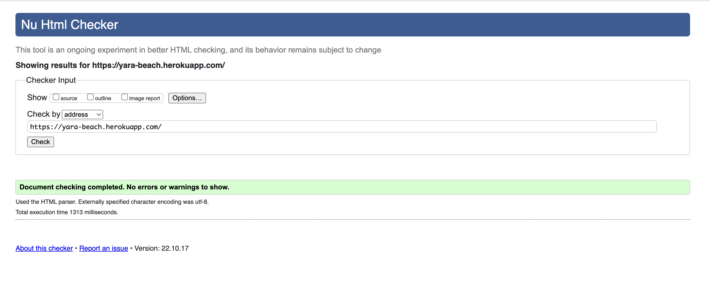
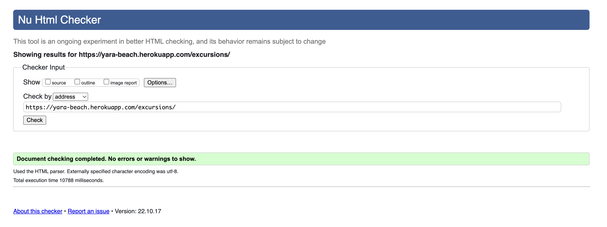
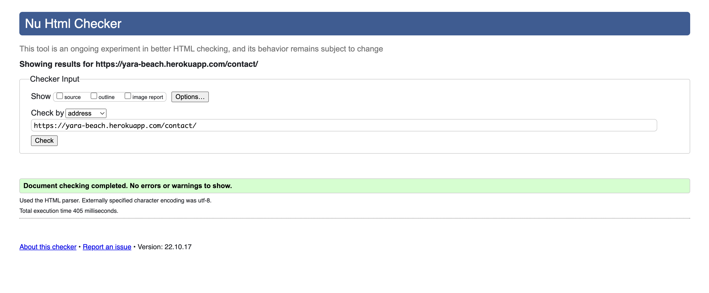
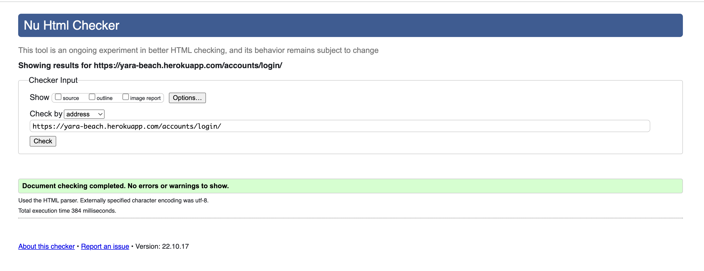
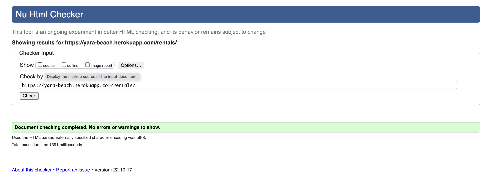
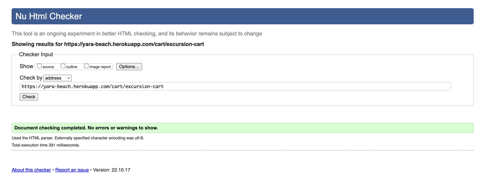
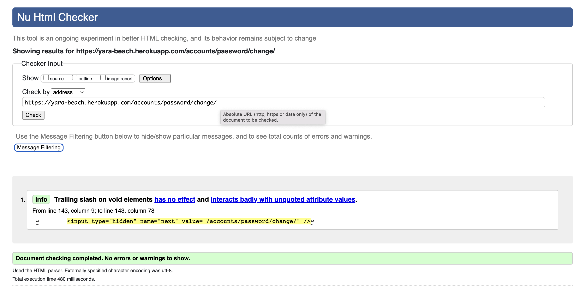
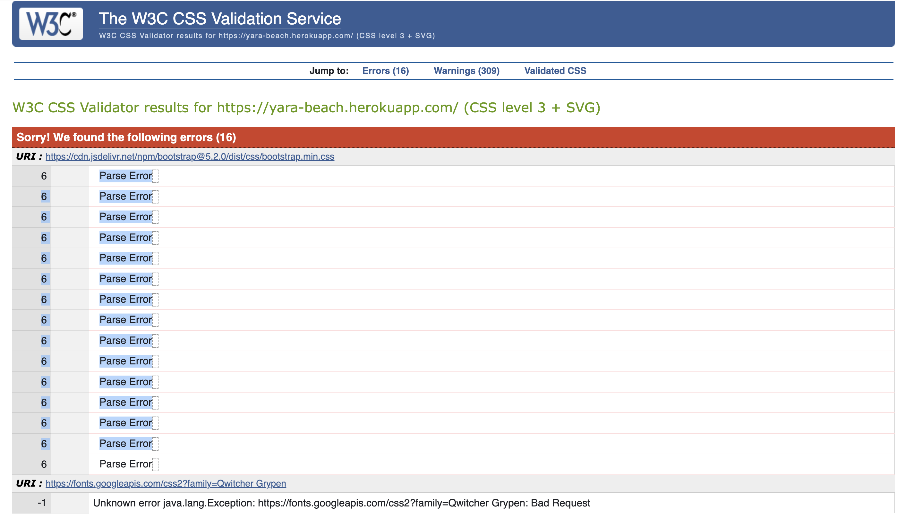
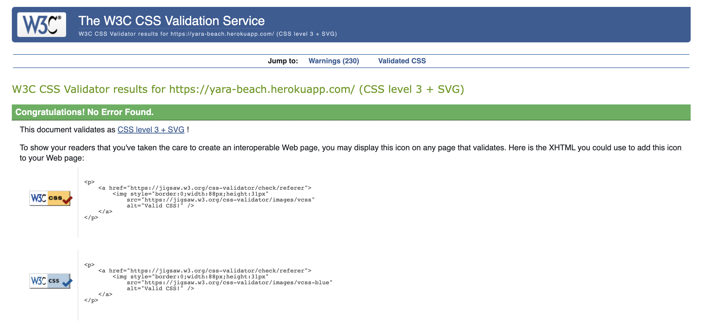

# Yara Beach - Testing Documentation

The Main README documentation can be found under [README.md](README.md)

# Table of contents

- [Code Validation](#code-validation)
  - [HTML](#html)
  - [CSS](#css)
  - [JavaScript](#javascript)
  - [Python](#python)
- [Performance](#performance)
- [Manual Testing](#manual-testing)
- [Automated Testing](#automated-testing)
- [User Story Testing](#user-story-testing)
- [Responsiveness](#responsiveness)
- [Bugs](#bugs)

 

---

### **HTML**

[W3C HTML Validation Service](https://validator.w3.org/) was used to validate the HTML code.

Each page was validated by URI or Direct Input.

### Home page

### Excursion page

### Contact page

### Login page

### Rental page

### Excursion Cart page

### Excursion Checkout page

.png "Ecursion cart page showing no errors.")

### Password change page

Password change page")

 

The following table shows the pages that were checked.
No errors or warnings remain.

 

 

##### back to [top](#table-of-contents)

---

### CSS Validation

[W3C CSS Validation Service](https://jigsaw.w3.org/css-validator) was used to validate the style.css file.

There were 16 errors, but these errors were not from my CSS File, they were from bootstrat 5.2(latest) and Google Fonts. So I have to change both of them so the test can pass.

 

 

##### back to [top](#table-of-contents)

---

### Manual Testing
The Yara Beach website has been tested in the following browsers:
- Chrome Version 85.0.4183.121 
- Samsung Internet Version 12.0.1.47	
- Microsoft Edge Version 85.0.564.63 
- Opera 70
- Mozilla Firefox 81.0.1

The recipe website and functions as expected on Samsung Internet, Google Chrome, Microsoft Edge, Opera and Firefox.
 

### Responsiveness
The Yara Beach site was tested for responsive design using [Google Chrome Developer Tools](https://developers.google.com/web/tools/chrome-devtools).  
It was tested, and found to respond appropriately with regard to each of the following:

**Mobile devices:**
- Moto G4
- Galaxy S5
- Pixel 2
- Pixel 2 XL
- iPhone 5/SE
- iPhone 6/7/8
- iPhone 6/7/8 Plus
- iPhone X

**Tablet devices:**
- iPad
- iPad Pro
- Surface Duo
- Galaxy Fold

**Laptop dimensions:**
- 15" Laptop (1024 x 800)
- 13" Laptop (1024 x 800)

**Desktop dimensions:**
- 24" Desktop (1920 x 1200)
- 22" Desktop (1680 x 1050)
- 20" Desktop (1600 x 900)

 
## Navigation bar (Navbar)

## Navigation in (footer)

All functionality for the footer was manualy tested on every page.

* Visit all links within the navbar in every possible order to ensure they are functional and route correctly.

## Form
*Ensure all placeholders has its appropriate name.
*Ensure Full Name field accepts any value, but requires at least one character to be deemed valid.
*Ensure Subject field accepts any value, but requires at least one character to be deemed valid.
*Ensure Message field accepts any value, but requires at least one character to be deemed valid.
*Ensure Email field only accept values in appropriate email format and cannot leave it in blank.
*Ensure all input request are met before submitting the form.
*Ensure users received the nice and tidy message after submitting the form.

 

# Bugs
Because there were issues with the bootstrap cdn 5.2, the latest one. I had to change the CDN for an older one, which might mess up some classes in the navbar and other places.

